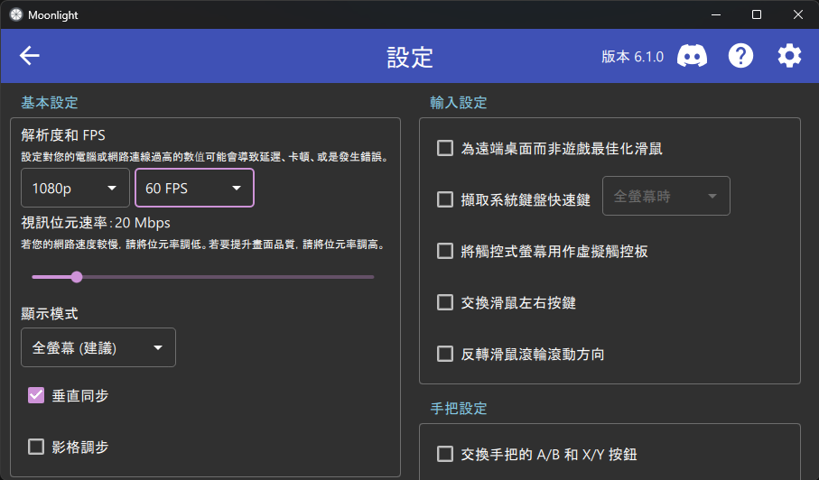
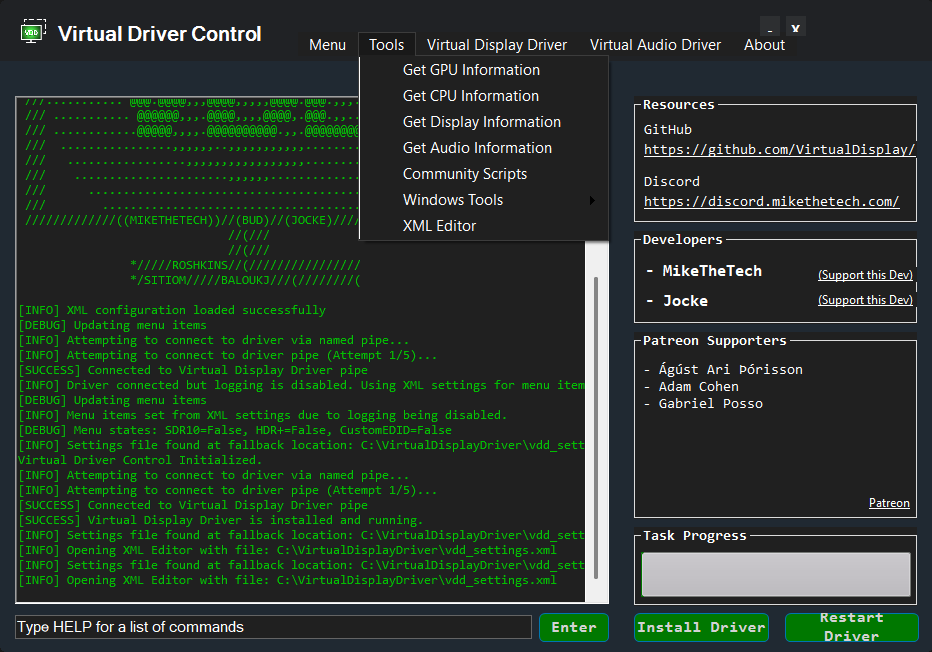
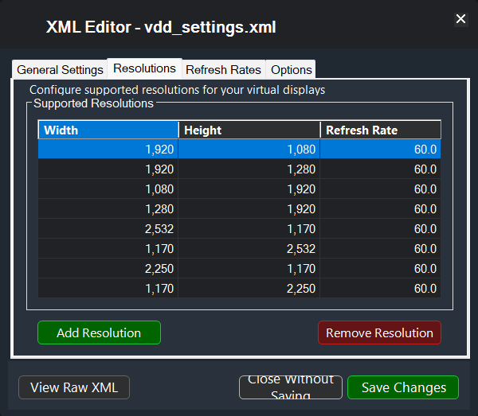
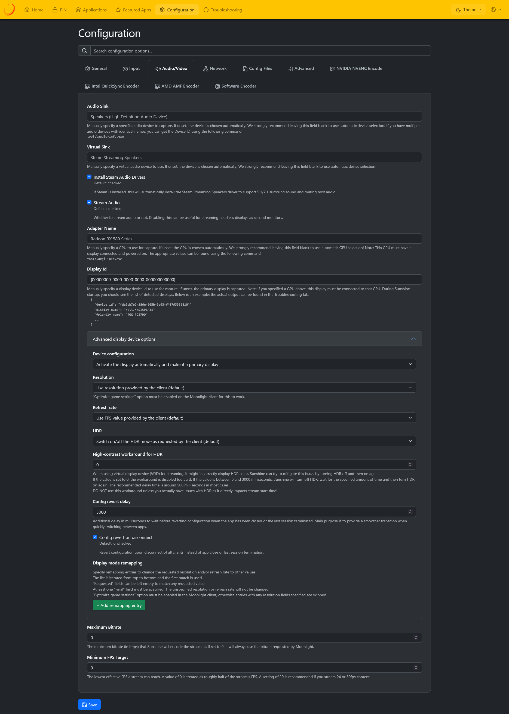
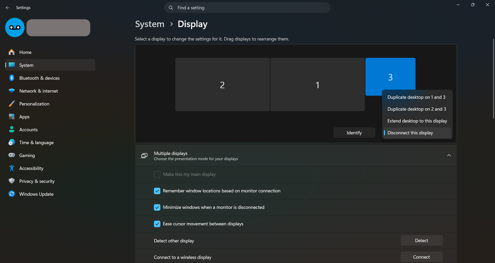
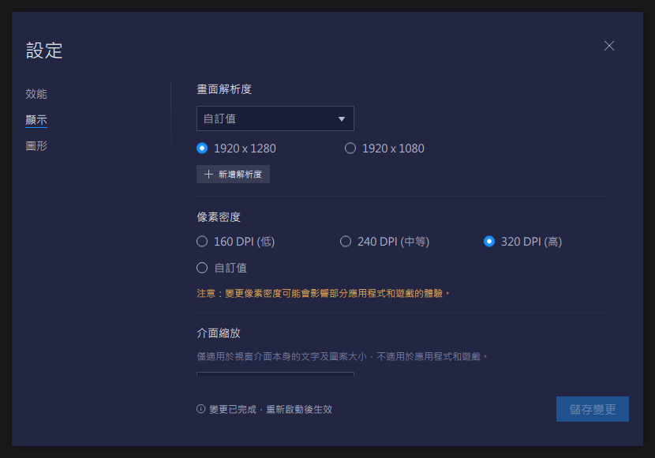

> Disclaimer：本文截稿至［2026-06］，由於技術的飛速發展，部分介面、指令或設定可能已經變了，請以實際情況為準。

我的那台 Surface Go 2，雖然是 m3 的商用版本，性能不能說沒有，只能說聊勝於無，大概也就只夠開一個 Chrome。不要說 3A 大作這種癡心妄想，就連大一點兒的獨立遊戲都不一定跑得起來。但 Surface 再怎麼說也還是平板，必須得上得廳堂、下得六疊間。為了彌補性能上的不足，我們只好讓它學會低端商用設備的傳統藝能：瘦終端！

[瘦終端（thin client）](https://zh.wikipedia.org/zh-tw/%E7%98%A6%E5%AE%A2%E6%88%B7%E7%AB%AF)，顧名思義，是一種終端：給人用的設備，有螢幕負責顯示輸出、有鍵鼠負責接收輸入。它「瘦」的地方在於，它本身可以非常貧弱，甚至不需要五臟俱全；一些厲害的瘦終端，連自己的硬碟都沒有。那如此雜魚的設備要怎麼工作？那就是連線到一台上位主機，把算力、儲存空間，甚至整個作業環境都交給它的主人提供。自己只管把畫面顯示出來、把操作送出去。簡直就是遠端桌面專用機。雖然瘦終端的潛力遠不止於此，但本文就只講它作為「遠端桌面」的這一部分。

我們的目標很簡單：把 Surface Go，或者說任意手機、iPad、Android 平板之類的中低端設備，變成主力 PC 的一塊副螢幕一般。遊戲和應用照樣跑在上位主機上，但畫面要能以受端設備的原生解析度完整鋪滿螢幕，看起來就像原生跑在這台設備上一樣清晰、順暢。

首先，我們會需要一台能跑 3A 大作或者《原神》的上位主機。當然，它除了要負責遊戲本身，還得負擔畫面串流與即時編碼的工作，這多少也會吃掉一點性能。想必在座各位的主力 PC 都比我這台好上不少，而且遊戲、或者其他想要串流的應用，早就已經裝好了；它們自然就非常適合擔任這裡的上位主機。

出場角色：

- 一台上位主機：裝著遊戲的，性能強大的電腦；
- 一台終端設備：性能雜魚，但卻妄想玩遊戲，例如 Surface Go。

再更重要的事，我們需要一個非常穩定的區域網路。以 1080p FHD、60 Hz 串流為例，大概就需要 30 Mbps 左右的網路頻寬；這可不是「下載速度能有 4 MB/s」或者「YouTube 可以順暢看 1080p」那麼簡單，而是一條必須持續、穩定、低延遲地供應的資料流。畢竟遊戲打到一半可不想要畫面突然糊成馬賽克藝術，或者開始跑加載進度條。

既然這套東西要在內網裡長期穩定通訊，我建議至少先在本地路由器上，替 Sunshine 那台上位主機指定固定的 IP 位址；實際上通常是透過 DHCP 保留或 IP 綁定來做。雖然這一步不是非做不可，但可以避免哪天路由器心血來潮重新發牌，結果主機突然換了地址、終端找不到主人。由於各家的路由器介面和設備配置都不太一樣，這裡就不細講。

我們用到的是 Sunshine / Moonlight 這對開源軟體；它們依循的是曾經由 NVIDIA 開發的 GameStream，但後來又慘遭遺棄的技術⋯⋯但這倒不代表技術本身不行，也許只是商業考量，畢竟現在 NVIDIA 沈迷 AI 無法自拔。相對地，這套組合反而已經是一個成熟、功能完整，而且開源的解決方案。

[Moonlight](https://moonlight-stream.org/) 是跨超多平台的開源「客戶端」，裝在實際想拿來玩的終端設備上；Windows、macOS、Linux、ChromeOS 之類的桌面平台自不必說，iOS、Android 行動端也可以。

[Sunshine](https://app.lizardbyte.dev/Sunshine/) 則是專為 Moonlight 準備的主機端「伺服器」，架設在那台裝著遊戲的上位主機上，負責把畫面擷取、編碼後串流出去。可跑在 Windows、Linux、macOS，甚至 FreeBSD 之類的桌面和伺服器平台上。

而這套系統可不是傳統遠端桌面；它本來就是朝低延遲遊戲串流設計，除了最最基本的畫面傳輸和鍵鼠控制以外，連音訊輸出、遊戲控制器（手把），甚至觸控螢幕的輸入都能處理。

## Sunshine

在本文的例子裡，Sunshine 是裝在 Windows 上；再次提醒，是那台已經裝好遊戲、也就是實際要被串流的主力電腦。

安裝起來也甚是簡單，打開 Windows Terminal 或 PowerShell，輸入：

```powershell
winget install -e --id "LizardByte.Sunshine"
```

若希望終端設備的遊戲控制器（手把）能被上位主機辨識，也可以裝上 ViGEmBus。但由於某些大人的原因，我們實際安裝的是 [HidHide](https://github.com/nefarius/HidHide)：

```powershell
winget install -e --id "Nefarius.HidHide"
```

啟動 Sunshine 後，在系統托盤，也就是工作列右下角那一排小圖示裡，會出現它的圖示；點開後選「Open Sunshine」，瀏覽器應該會帶你進入 `https://localhost:47990`（以實際情況為準），這就是它的設定介面。第一次進去時，瀏覽器可能會因為它使用自簽憑證而跳出不安全網站警告，正常放行即可。初次使用時需要設定帳密。

成功登入之後，上位主機端就先放一邊吧：畢竟我們還沒裝 Moonlight 客戶端，暫時也沒法測試。🤷

至於 ViGEmBus，它是一個在 Windows 底下模擬遊戲手把的核心層驅動。裝好、必要時重開機，之後基本上就是射後不理。

## Moonlight

接下來就是客戶端 Moonlight。再次提醒，這台才是那台性能雜魚、卻妄想玩遊戲的設備。

若也是 Windows，安裝同樣簡單，打開 Windows Terminal 或 PowerShell，輸入：

```powershell
winget install -e --id "MoonlightGameStreamingProject.Moonlight"
```

這台不需要再裝 ViGEmBus；它是上位主機端 Sunshine 用來模擬虛擬遊戲手把的驅動，受端只要負責把自己接到的手把操作送出去即可。

若是 iOS 或 Android，那就更簡單了，直接到 App Store 或 Google Play 下載 Moonlight 即可。

1. Moonlight 基本上開箱即用，這裡先保留預設設定。進去後手動新增主機，輸入 Sunshine 那台上位主機的 IP。若能成功連上，Moonlight 會給出一組數字配對碼。

2. 這時回到 Sunshine 的設定介面，找到 PIN 頁面，輸入這組配對碼，再替這台受端隨便取一個煞氣a名字，配對就完成了。

3. 接下來回到 Moonlight，主機底下應該就會出現 Sunshine 提供的應用清單；選擇其中的 Desktop，若一切順利，便能看到 Sunshine 主機上的主螢幕畫面。

然後你可能就會發現：哇，這個畫面怎麼糊成這樣，我的眼睛業障重啊🫣……

這是 Moonlight 的預設碼率未必剛好適合你的設備和網路；在 Windows 上可以按 `Ctrl + Alt + Shift + Q` 結束串流，進入設定後，設定解析度和幀率，再把預設的「視訊碼率」往上拉。原則很簡單：在網路撐得住的前提下，碼率越高，畫面通常就越清楚。但也不能無腦拉滿：串流需要的是持續、穩定的頻寬；碼率一旦超過網路能穩定供應的程度，畫面反而會開始糊、卡頓，甚至斷線。所以適合自己的才是最好的。



至於連預設值都會卡怎麼辦？先不要硬拉更高，反而可以試著降一點碼率；若是無線網路，就靠近 AP、換到訊號更好的地方，或者想辦法讓上位主機走網線。再不行的話⋯⋯那可能就把剛剛的都刪一刪收工吧。

到此，我們已經完成 Sunshine / Moonlight 遊戲串流系統的架設，雜魚設備玩遊戲的夢想，已然實現。但這還不夠；我們還能把它變得更加完美。

通常 Sunshine / Moonlight 兩台設備的螢幕尺寸與比例都不一樣。以我自己為例：PC 接著一台 1920×1080 60 Hz 的螢幕；Surface 卻是更方的 1920×1280 60 Hz 螢幕。直接串流時，上下自然會多出黑邊；若播放的內容比例又不對，原本在主螢幕左右兩側也有黑邊，那就會變成四面楚歌。本來就不大的螢幕，真正能看到的內容卻小得可憐。更麻煩的是，Surface 這種小螢幕卻塞了如此高的解析度，DPI 很高；直接照 PC 的 1080p 畫面串過來，UI 在 Surface 上就會顯得過小。我可不想玩一個美少女遊戲，最後變成阿嬤看報紙。

這時候我們就想，要是在 Sunshine 那台電腦上，能有專用串流的螢幕就好了。

## Virtual Display Driver

我們使用開源的 [Virtual Display Driver（VDD）](https://github.com/VirtualDrivers/Virtual-Display-Driver)。正如其名，它會給 Windows 虛擬的接上一台虛擬的螢幕，我們要的就是這樣一台專門留給 Moonlight 串流用的螢幕。

安裝還是很簡單，打開 Windows Terminal 或 PowerShell，輸入：

```powershell
winget install -e --id "VirtualDrivers.Virtual-Display-Driver"
```

這個套件自帶其控制介面 Virtual Driver Control。安裝完成後啟動它，由於 Winget 的「綠色安裝」可能找不到程式圖標，輸入這指令打開其界面：

```powershell
& 'VDD Control.exe'
```

> ⚠️ VDD 的官方文件明確提醒：大型 GPU／晶片組驅動更新前，最好先移除 VDD；否則 Windows 可能把虛擬顯示器排成優先，極端時造成開機黑畫面。



點選右下角按鈕「Install Driver」安裝驅動程式。

我們需要設定的是這台虛擬螢幕支援哪些解析度與幀率；接著從選單「Tools -> XML Editor」進入設定編輯視窗，選擇「Resolutions」分頁。只要依照 Moonlight 設定頁顯示的受端原生解析度與幀率是最準的，或者去查這臺設備的規格表，加入對應的顯示模式即可。

例如我的 Surface Go 橫放時是 1920×1280、60 Hz；若打算直著拿，也可以順手加上 1280×1920、60 Hz。填寫完成後儲存，再回到 VDD 介面重新載入螢幕即可。



接下來回到設定 Sunshine。

首先，重開 Sunshine：在右下角系統托盤選擇「Restart」，讓它重新讀到我們剛剛建立的虛擬副螢幕。接著回到設定網頁，到 Troubleshooting 頁面找到那台虛擬螢幕，往下翻找到「Logs」在開頭的不遠處你會看到類似的如下片段：

```jsonc
{
    "device_id": "{00000000-0000-0000-0000-000000000000}",
    // ...
    "friendly_name": "VDD by MTT",
    // ...
}
```

1. 重點是 `"friendly_name": "VDD by MTT"` 的那一組即是我們剛剛安裝的虛擬螢幕，把它的 `device_id` 複製下來（包括大括號，長這樣： `{00000000-0000-0000-0000-000000000000}`）。

2. 然後回到「Configuration」的「Audio/Video」頁面進行設定。

3. 在「Display Id」填寫剛剛的 `device_id`。

4. 在 「Advanced display device option」中的「Device configuration」，選擇「Activate the display automatically and make it a primary display」，也就是「開啟這臺螢幕並將它設為主螢幕」。

5. 勾選「Config revert on disconnect」，也就是「結束後再恢復原本的設定」。

至於解析度和更新率這裡都先維持預設即可。只要 Moonlight 端啟用 Optimize game settings（預設啟用），Sunshine 就會依照受端請求的解析度和刷新率，自動匹配到剛剛 VDD 設定的模式。如此一來，換成不同設備連線時，虛擬螢幕也會跟著變。

設定為主螢幕的話，大部分程式都會預設在這塊螢幕上開啟；若工作列上明明有程式，卻怎麼找都看不到視窗，它很可能就是迷路跑到別的螢幕去了。

<details>
<summary>🖼️ 設定頁面大概長這樣。</summary>



</details>

在正式開始串流之前，還要修改 Sunshine 那台電腦自己的 Windows 顯示設定。



1. 取消勾選「Make this my main display」，它平常不該是主螢幕。
2. 在「Scale & Layout」的「Scale」縮放倍率要依你的 Moonlight 端設備調整，例如我的 Surface Go 2 我會選 175% 或 200%。
3. 模式選擇「Disconnect this display」，它平常不用的時候應該保持關閉，否則滑鼠，甚至視窗，都可能一不小心迷路到這塊看不見的螢幕裡。

設定完成後，再回到 Moonlight 端其實基本上不需要什麼修改，確認串流解析度與更新率已經選設備的原生值。接著開始串流，若一切順利，就能看到沒有黑邊、以原生解析度呈現的桌面了！

## Tricks

平常沒有串流時，這台虛擬螢幕其實是看不到的。可以用 OBS 擷取這個螢幕，這樣就能在預覽視窗裡看到它。

要退出 Moonlight 的話，若你和我一樣懶得按鍵盤，Surface 這類觸控螢幕 Windows 設備有個小 trick：從螢幕底部邊緣往上拖，通常可以叫出本機的工作列；長按 Moonlight 的程式圖示，按下關閉，就能退出串流。

而且工具列上還能叫出虛擬鍵盤，直接把輸入穿透進 Moonlight 裡面。這個 trick 簡直贏兩次。

順便提醒，關掉 Moonlight 只是斷開客戶端，不一定會結束主機上正在跑的遊戲或應用，若是虛擬螢幕被關閉後視窗會跑回原本的螢幕。所以可要注意在斷開前，記得要先關掉一些見不得人的東西。😉

之後就可以發揮自由的想像力了：開 Steam 暢遊（那些 Sunshine 主機跑得起來的）3A 大作；工作、寫程式時把它放在桌邊，當成一塊真正能用的副螢幕；甚至把 BlueStacks 全螢幕打開，直接 cosplay 一台 Android 平板。

BlueStacks 也是可以調整解析度，甚至可以通過調整像素密度的方式放大畫面：



其中：同樣的解析度下，螢幕越小，像素密度 DPI 越高。提高像素密度的設定可以讓界面看起來更大。

最終，我們就完成了這套本地分散式家庭娛樂集群解決方案。
