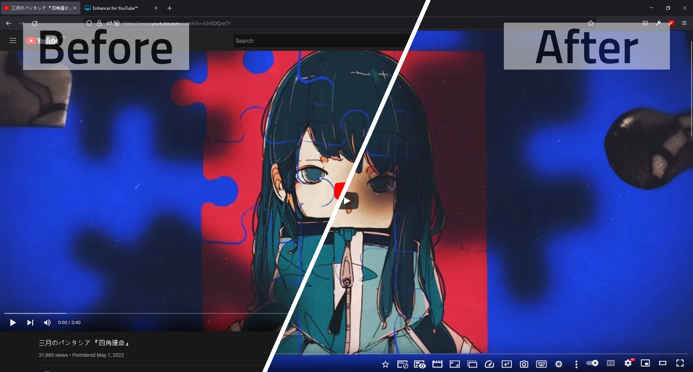

> <del>巨幅銀幕、人體工學</del>

Enhancer for YouTube™ 是一個免費、專有擴充套件（[Firefox Add-on][Enhancer for YouTube Firefox], [Chrome Extension][Enhancer for YouTube Chrome]），它為 YouTube 播放器添加了超多實用的功能，
功能超多到以至於很難介紹，也很難介紹完，
是 YouTube 增強系的擴充套件的集大成之作，就像瑞士刀。

[Enhancer for YouTube Firefox]: https://addons.mozilla.org/firefox/addon/enhancer-for-youtube/
[Enhancer for YouTube Chrome]: https://chrome.google.com/webstore/detail/enhancer-for-youtube/ponfpcnoihfmfllpaingbgckeeldkhle

- 聲音拉到最大都聽不清，就可以開啟**音量增強**的功能；
- 畫面看不清楚，可以用**影片濾鏡**調整亮度、對比、飽和度...
- 影片太慢心太急，1.25 太慢、1.5 跟不上，可以精密的到以 0.05 為步進 **調整播放速度**；
- 畫面太小，全熒幕又不方便，可以**鎖定劇院模式**；
- 劇院模式畫面留邊還是太小，**放大播放器**撐滿整個視窗；
- 想要DD多開視窗，或是摸魚想要有影片陪伴，可以把影片放進**彈出視窗**；
- 遇到喜歡的音樂可以開啟洗腦**循環播放**；
- 界面看膩了，可以**客製外觀主題**，就像買了一臺新電視；
- 看影片資訊、聊天留言時候迷你播放器畫面上，視聽不中斷；
- 隱藏卡片、留言區、聊天室、推薦影片，甚至有可以添加排除名單的**擋廣告**。

更多的播放控制工具，都可以通過小按鈕快速開關，預設會在播放器下方添加一個工具列，也可以融入播放器的控制列。

還有一些沒有介紹到的功能，推薦載來玩玩看。

